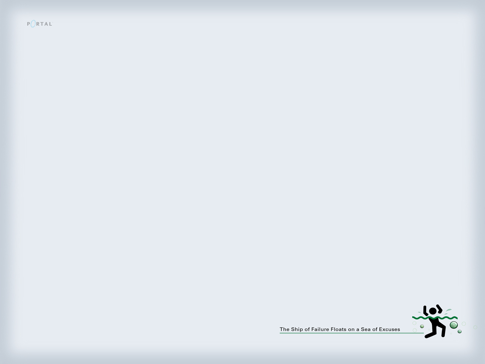

Projet Ingénierie - Tâches Responsable Qualité
==============================================

1. Versions / Configurations
----------------------------
- Tableur répertoriant les versions: date, événements, qui l'a changé, le numéro de version avant et après
- Plan de config: voir une suggestion de plan dans le cours.

2. Cohérence interne des livrables
----------------------------------
- Modèles de documents
- Validation croisée
- Rappels de bonne pratiques lors des revues
	* Synchro diagrammes de séquence / classe

3. Adéquations entre les solutions et les besoins des clients
-------------------------------------------------------------
Procédure ... qualité recueil d'exigences:
- Identification de design patterns
- Bonnes pratiques

4. Bon déroulement des revues externes et internes
---------------------------------------------------
Procédure de bon déroulement des revues: Logigramme, décrivant l'enchaînement
de choses à faire avant, après, pendant.

5. Dossiers de synthèse
-----------------------
Participer à sa rédaction, faire le draft. 

Risques
=======
Trop ou trop peu de qualité.

Test Image
==========

Tesr Image 2
